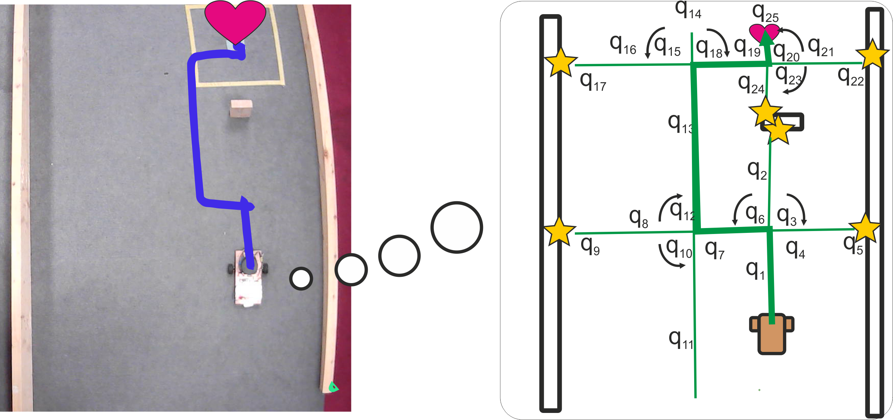

# Bratmobile



The navigation problem is broken down into several unique closed-loop input controllers, called Tasks. Each Task produces a unique control behaviour (go straight, turn left/right 90 degrees) in response to a [Disturbance](https://en.wikipedia.org/wiki/Errors_and_residuals), which determines a Task's duration. A supervising module, called the Configurator, can simulate sequences of Tasks at runtime in game engine [Box2D](https://github.com/glafratta/box2d), retain their outcomes in a cognitive map, which can be searched to extract plans. The physics simulation represents the robot's [Core Knowledge](https://www.harvardlds.org/wp-content/uploads/2017/01/SpelkeKinzler07-1.pdf) (Spelke, 2007).

Note this is a fork of the orig repo: https://github.com/glafratta/bratmobile

## Features:
* Hybrid state-space representation where states are Tasks focused on a specific object
  
* Landmark based navigation: robot is ready to go as is, no need for global maps/SLAM

* Plans are made up of multiple Tasks (object-focused instructions), not trajectories

* On-the-fly replanning

* `fastdds` folder: provides classes to publish Task data to a Qt window 

### Publications

Giulia Lafratta, Bernd Porr, Christopher Chandler, Alice Miller; Closed-Loop Multistep Planning. Neural Computation 2025; 37 (7): 1288–1319. doi: [https://doi.org/10.1162/neco_a_01761](https://doi.org/10.1162/neco_a_01761), [Preprint](https://arxiv.org/pdf/2402.15384) and [Final publication on Glasgow University's repository](https://eprints.gla.ac.uk/348892/).

## Hardware
The indoor robot is equipped with 
* Raspberry Pi model 5
* [Zetabot with 360 Parallax Continuous Rotation Servo motors and stereo cameras](https://github.com/berndporr/zetabot))
* [C1 SLAMTEC LIDAR](https://github.com/berndporr/c1lidar)

## Prerequisites
### Development packages

```
sudo apt install g++ cmake libopencv-dev libboost-all-dev xorg-dev libglu1-mesa-dev libgtest-dev xauth x11-apps xfonts-base
```

### Libraries to compile from source

* [C1 LIDAR API](https://github.com/berndporr/c1lidar)
* [Zetabot API](https://github.com/berndporr/zetabot)
* [Cpp Timer](https://github.com/berndporr/cppTimer)
* [libcamera2opencv](https://github.com/berndporr/libcamera2opencv)

### Install powersave service

The rpi5 draws too much current under load to run off the battery so we need to enable powersave:

sudo cp powersave.service /etc/systemd/system
sudo systemctl enable --now powersave.service


## Build

```
cd bratmobile
cmake .
make
```

## Run
### Navigation demo (Raspberry Pi)
Demo prefixes:

* `brat2*` : Multi-step planning with fixed discretisation of Tasks with DEFAULT actions
* `brat3*` : Multi-step planning with fixed-size state split (of states ending in collision) and attention window to guide optimal obstacle avoidance when a goal is present

Demos:

* `./*targetless` : these programs demonstrates planning over a 1m distance horizon for a control goal that is not a target location but rather an objective to drive straight for the longest time with the least amount of disturbances
* `./*target`: these program demonstrates target seeking behaviour, where the target is imaginary and located at x=1.0m, y=0m.

### Unit tests 
`ctest`

run `make test`
