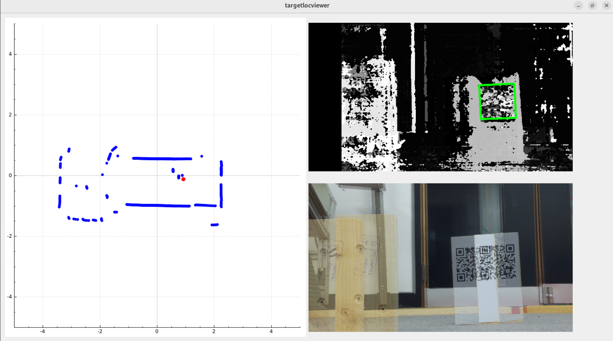

# QT Viewer

This is for debugging purposes and just polls the data
of the detector.

## Prerequisites

```
apt install libopencv-dev libcamera-dev qt6-base-dev
```

## Compilation and running it

```
cmake .
make
./targetlocviewer
```



## Credit

 - Bernd Porr
